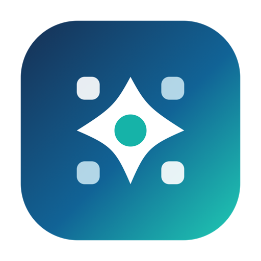

  

<h1 align="center">SkillDock</h1>

---

  One app to manage Skills, MCP servers, Git updates, and coding-agent sync.

  <a href="./README.zh-CN.md">中文说明</a>

  
  
  

## Features

- **Skills management** — Install, update, delete, edit, and inspect local skills.
- **Complete Git workflow** — Keep each Git-based skill as a real repository, with upstream update checks, local change detection, pending push state, update previews, and push previews.
- **Marketplace install** — Browse and install skills from `skills.sh`, `skillsmp`, and other sources.
- **Git repository install** — Discover and install skills from GitHub, GitLab, Gitee, and compatible repositories.
- **Local import** — Scan existing local skill folders and bring them into SkillDock.
- **Multi-tool sync** — Sync skills to 29 built-in coding-agent / IDE tool directories.
- **MCP management** — Browse, install, import, enable, disable, and sync MCP server configs.
- **MCP tools discovery** — Detect tools exposed by MCP servers and check whether configs are usable.

## Git-Aware Skills

SkillDock keeps Git metadata instead of flattening skills into plain copied folders.

- Check whether a skill has upstream updates.
- See whether a local skill has uncommitted changes.
- Preview update changes before pulling.
- Preview push changes before sending them back.
- Preserve source repository information for team-maintained skills.

## Supported Tools

Claude Code · Codex · Cursor · Windsurf · IntelliJ IDEA · OpenCode · Gemini · Antigravity · Continue · GitHub Copilot · Qwen Code · Trae · Trae CN · Cline · Roo Code · Kilo Code · Kiro · Goose · Junie · Augment · CodeBuddy · Droid · OpenClaw · CommandCode · Crush · Qoder · Zencoder · Hermes · iFlow

## Download

Installers will be published on the [Releases](../../releases) page.

| Platform | Status |
| --- | --- |
| macOS | Coming soon |
| Windows | Planned |

## Getting Started

1. Download and open SkillDock.
2. Install skills from a marketplace, Git repository, or local folder.
3. Enable skills and MCP servers for your coding tools.
4. Use Git-aware status to review updates, local edits, and push previews.

## Roadmap

- [ ] Public installers and screenshots.
- [ ] Better skill states: updateable, locally modified, pending push, conflicted.
- [ ] Fuller MCP lifecycle: install, configure, discover tools, and sync across tools.
- [ ] Better Git flows: branch selection, team repository pushback, PR/MR handoff.
- [ ] Windows support after the macOS workflow is stable.

## Source Availability

SkillDock is currently distributed as a closed-source preview.

Source code may be opened later after the first public release stabilizes.
